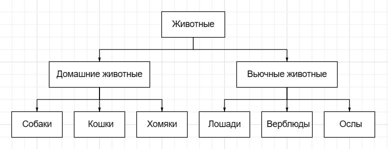

# Итоговая контрольная работа

1. Используя команду cat в терминале операционной системы Linux, создать два файла Домашние животные (заполнив файл собаками, кошками, хомяками) и Вьючные животными заполнив файл Лошадьми, верблюдами и ослы), а затем объединить их. Просмотреть содержимое созданного файла. Переименовать файл, дав ему новое имя (Друзья человека).

   cat > "Домашние животные.txt"
   Собаки
   Кошки
   Хомяки

  cat > "Вьючные животные.txt"
  Лошади 
  Верблюды
  Ослы

3. Создать директорию, переместить файл туда.

  

4. Подключить дополнительный репозиторий MySQL. Установить любой пакет
из этого репозитория.

5. Установить и удалить deb-пакет с помощью dpkg.

6. Выложить историю команд в терминале ubuntu

 
7. Нарисовать диаграмму, в которой есть класс родительский класс, домашние животные и вьючные животные, в составы которых в случае домашних животных войдут классы: собаки, кошки, хомяки, а в класс вьючные животные войдут: Лошади, верблюды и ослы).
cat > "Домашние животные.txt"

